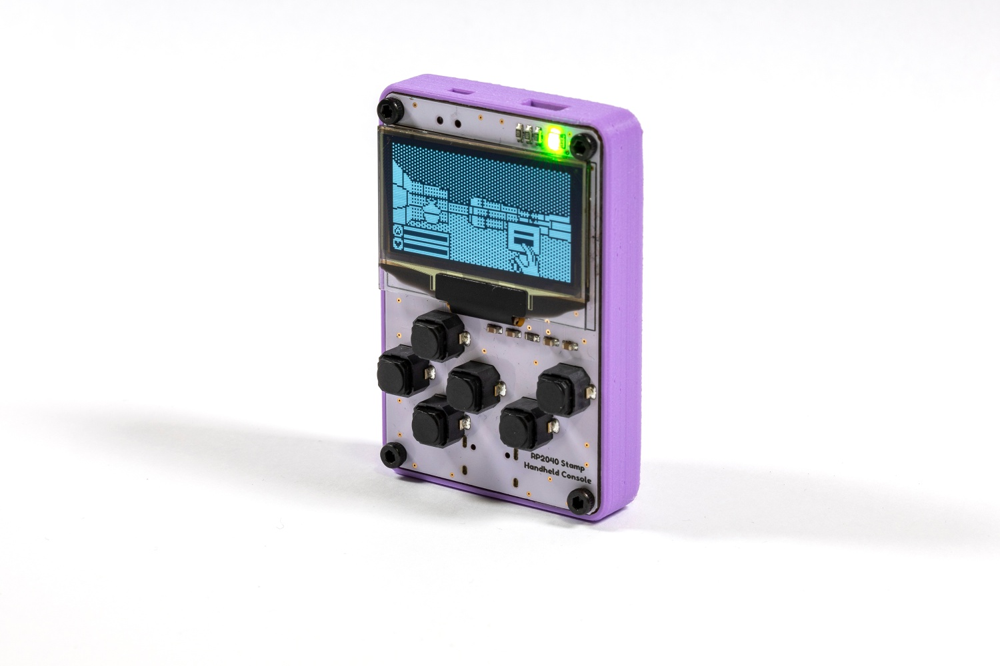

# RP2040 Stamp Handheld Console (Flux Project)

This Flux project transforms an RP2040 Stamp into a small handheld console with a **1.3" 128x64 OLED**, D-pad + A and B buttons, **RGB LED**, a **Qwiic** connector, a power switch, and a **speaker**.

As the console is powered by the Stamp, you can run **CircuitPython** on it, as well as **Arduino**, including experimental support for the **Arduboy2** library.

# Details

To make it truly portable, you will need a battery. This product does not ship with one, you can use any 3.7V/4.2V LiPo that is around or smaller than 40x30 mm. We recommend the [500mAh LiPo from Pimoroni](https://shop.pimoroni.com/products/lipo-battery-pack?variant=20429082055).

You can find a 3D-printable model for the case on [Printables](https://www.printables.com/model/279210-rp2040-stamp-handheld-console-case). You will also need four M2x4 screws and four M2 threaded inserts. 

# What does "Flux Project" mean?

At Solder Party, we always want to get interesting products in people's hands. However, releasing a product is no easy feat, we need to make sure everything is polished, provide documentation, examples, and extensive support.

With Flux, we want to streamline the process a bit, get fun projects into everyone's hands quicker.

Flux projects are more experimental in nature. While they are tested and verified, the documentation might not be fully there, and the examples might be very basic. 
Flux projects are targeted at people who are not scared to put a bit of extra work into getting the project to where they want it to end up.
These projects are also produced in smaller quantities, there is no guarantee there will be more produced in the future. Even if there is a new batch, it might differ from the initial version. 

These projects are in constant Flux, so to speak.

If there is enough interest, a Flux project might become a fully-fledged Solder Party product in the future, but there is no guarantee.

# Links

For more information visit https://flux.solder.party/